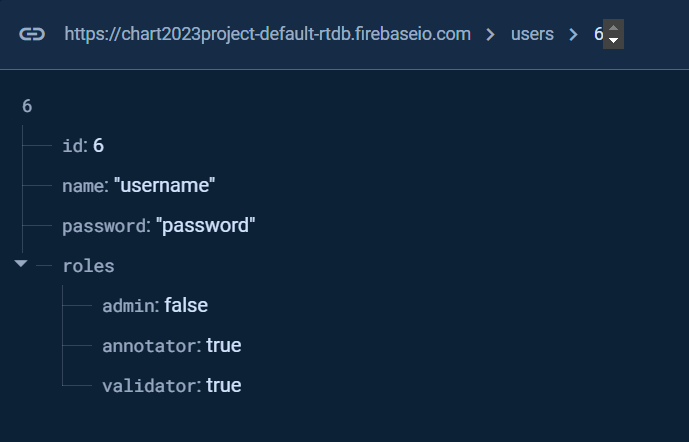
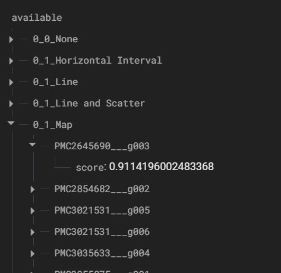
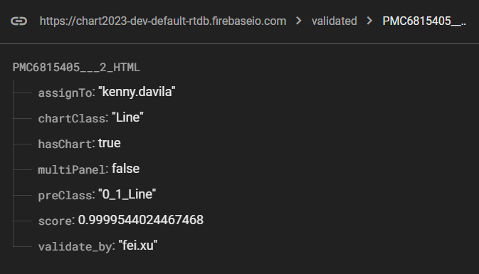

# Chart Classification App

This project was generated with [Angular CLI](https://github.com/angular/angular-cli) version 14.0.4. It uses [Firebase](https://firebase.google.com/docs) for hosting and the realtime database.

## Components

This tool facilitate the development of the CHART-Info 2024 dataset. It consisted in classifying over 300k charts (PNG format) by their type eg. area, scatter, bar, map, venn. Each chart had a pre-classification, which must be reviewed manually. Three types of user’s roles were used: assigner, annotator, and validator. Each role represents a different task found in the application:
* Chart Assignment: consisted in assigning groups of images to other users. 
* Chart Annotation: lists all the charts assigned to the user, each chart is filled with it´s pre-classification data. The user must correct the classification, if needed, and annotate the chart. 
* Chart Validation: Last, another user can validate the annotated charts listed in a gridview. If the user accepts the selected charts, they are ready and their classification process finishes. If they are rejected, they return to the assignment stage with a flag that indicates they have already been annotated wrongly.

## Running the project locally

### Firebase Configuration

First create Firebase project. It will require the following structure:
* Users collection

Each user has an id (used also as key for the user node), a name, a password, and the assigned roles. As described in the image below:

* Charts collections
1) Available collection: available charts are separated into subgroups based in their preclassification. The subgroup names are formatted as {panelType}\_{hasChart}\_{chartType}. Where panel type can be single panel (0) or multipanel (1), the image can have a chart (1) or no (0), and the chart type should match the ChartType.ts enum. Each image contains a score, which will be used for sorting based in the selected difficulty (easy, hard or any).
This charts are used during the assignment task. This is the starting point where the charts are loaded.

2) Assigned collection: When the image is assigned to an annotator user, it is moved to the assigned collection. This contains subgroups for each annotator, charts assigned to the user are added in it´s subgroup.
3) Annotated collection: When a user annotates a chart, it is moved to the annotated collection. This contains information such as the user who annotated the chart, the preclassification and score it initilly had, and the new classification given by the annotator (panel type, contains chart and chart type).
4) Validated collection: Once the chart gets annotated, it requires that a validator approves it. After the chart is validated, it is moved to the validated collection. Additionaly to the annotation information, this collection stores the user who validated the chart and the number or count of rejects it has.
This collection contains the final chart classifications.

In the Angular app, modify the following files:
* .firebaserc: references the Firebase project instance and hosting.
* firebase.json: references the hosting instance.

## Development server

Run `ng serve` for a dev server. Navigate to `http://localhost:4200/`. The application will automatically reload if you change any of the source files.

## Build

Run `ng build` to build the project. The build artifacts will be stored in the `dist/` directory.

## Further help

To get more help on the Angular CLI use `ng help` or go check out the [Angular CLI Overview and Command Reference](https://angular.io/cli) page.
