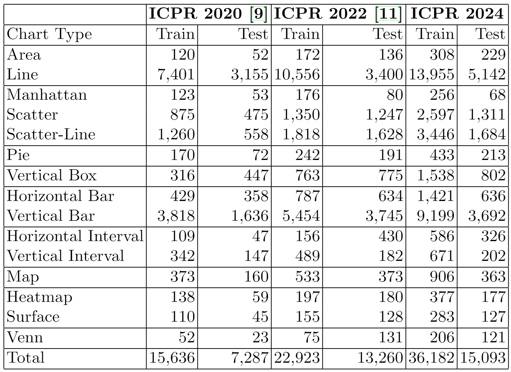
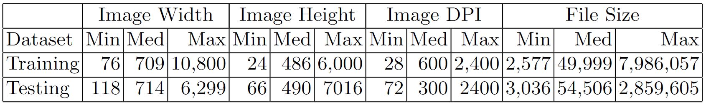

# The CHART-Info 2024 Dataset

This repository contains the Code and Data for the ICPR 2024 paper titled: "CHART-Info 2024: A dataset for Chart Analysis and Recognition"

# The Dataset

This datasaet was created as a collaboration between people from 4 different universities from different countries. More details about the dataset itself and its creation process can be found in our ICPR 2024 paper. This dataset also follows the conventions set up by the [CHART-Infographics competitions](https://chartinfo.github.io/)

## Stats

Distribution of chart types on the training and testing datasets. Values are
compared against earlier versions of the dataset.

Statistics (min., median, max.) for different image attributes in our dataset.

## Download

You can find the **Training Set** [here](https://www.dropbox.com/scl/fi/vy7gyemald8z6rohx9mxx/CHARTINFO_2024_Train.zip?rlkey=ki3q4bb02rzdpdbih17we63gm&dl=0).

You can find the **Testing Set** [here](https://www.dropbox.com/scl/fi/am33424ochxs4yryprl0p/CHARTINFO_2024_Test.zip?rlkey=lcacxvgljcr5p3zo8t1uss63m&dl=0).

If you have any issues while accessing the dataset, please let us know.

## Splits used in our Experiments

This will be posted soon. Plase Contact us if you need urgently need access to this.

# CODE

This will be posted soon. Plase Contact us if you need urgently need access to this.